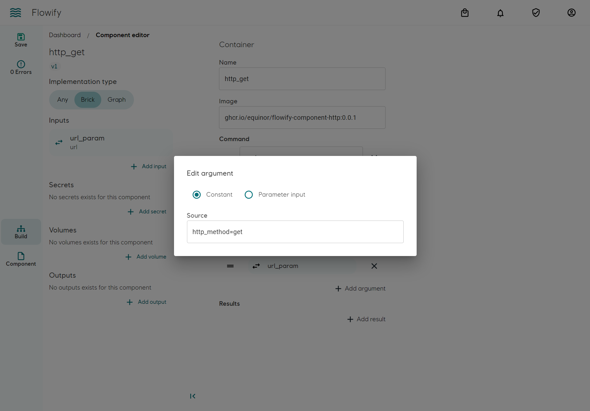
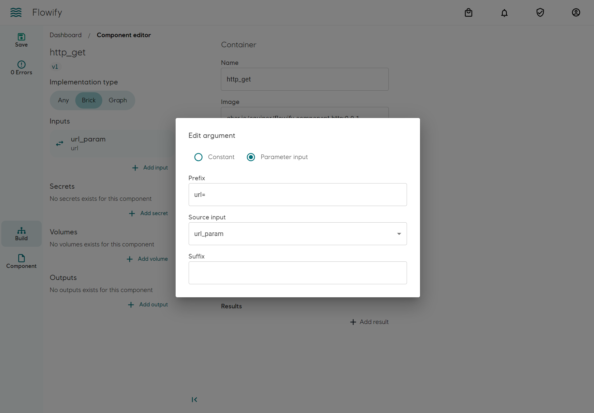
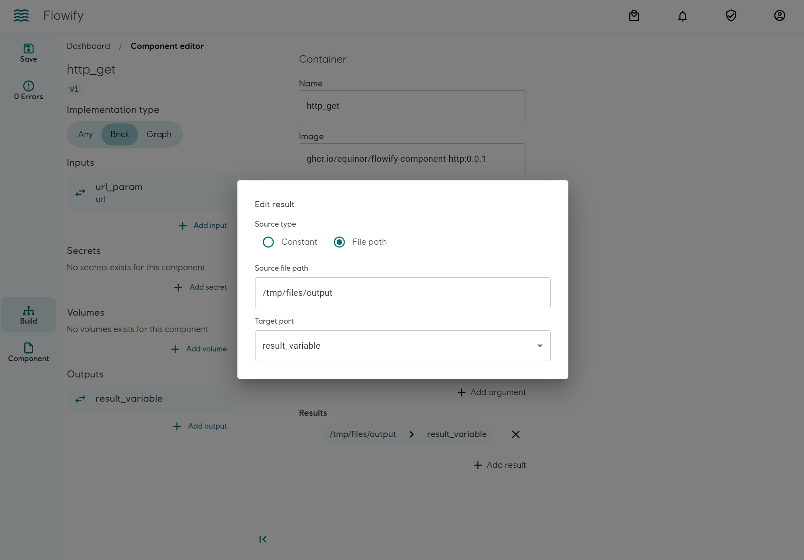
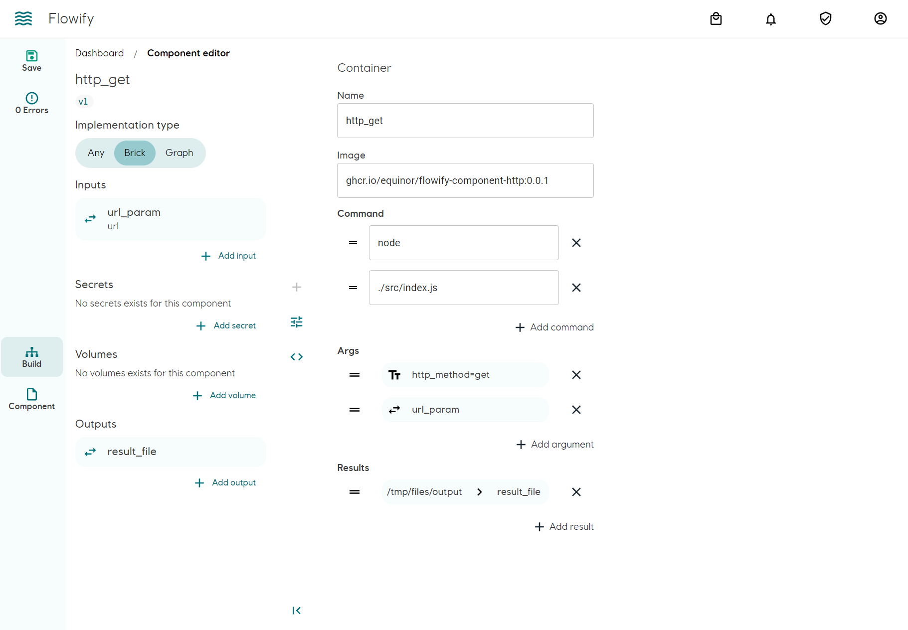
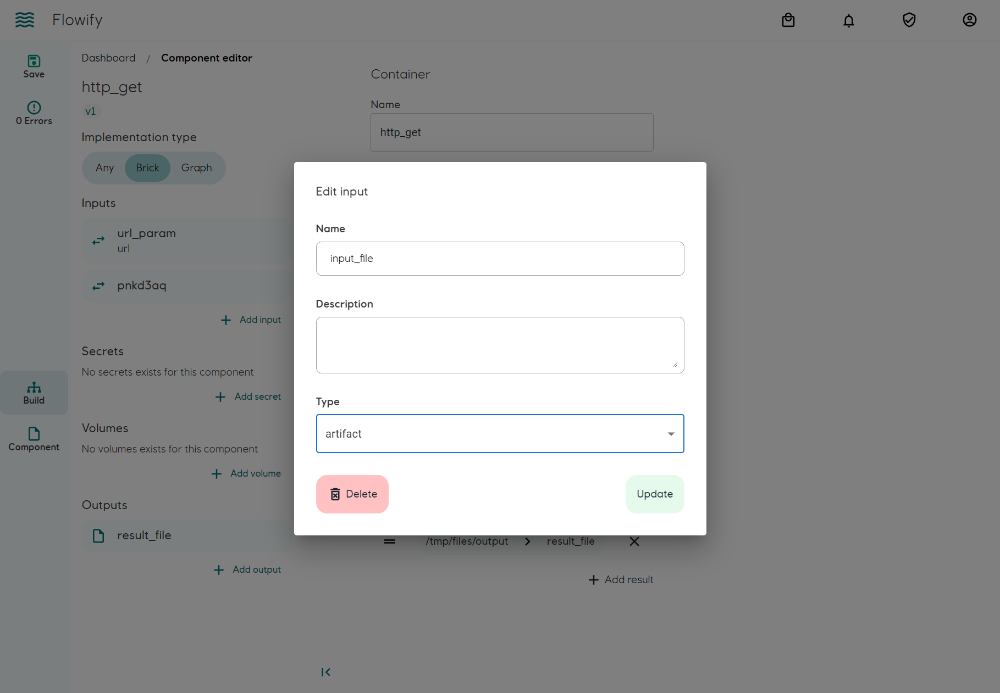
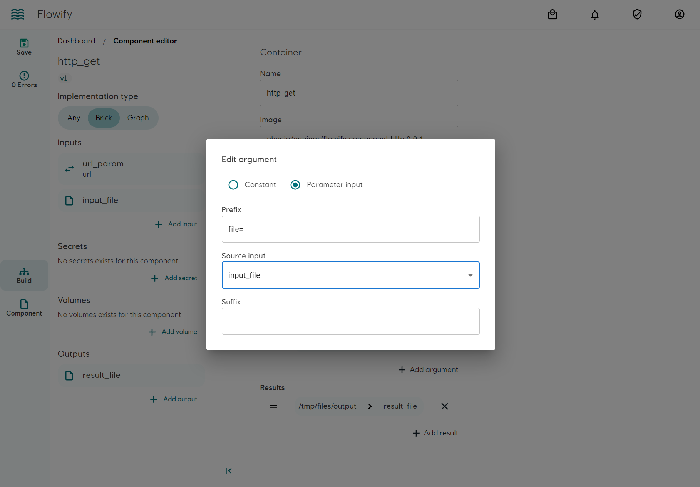
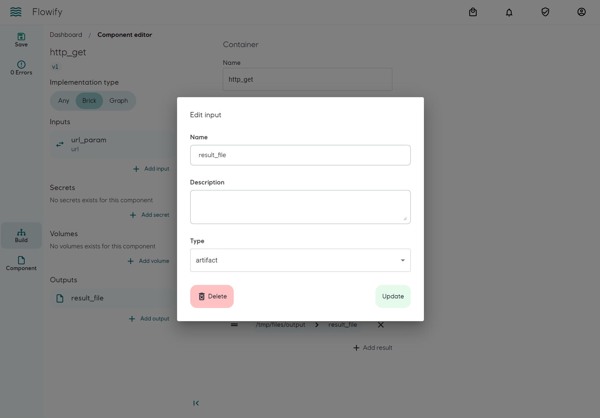
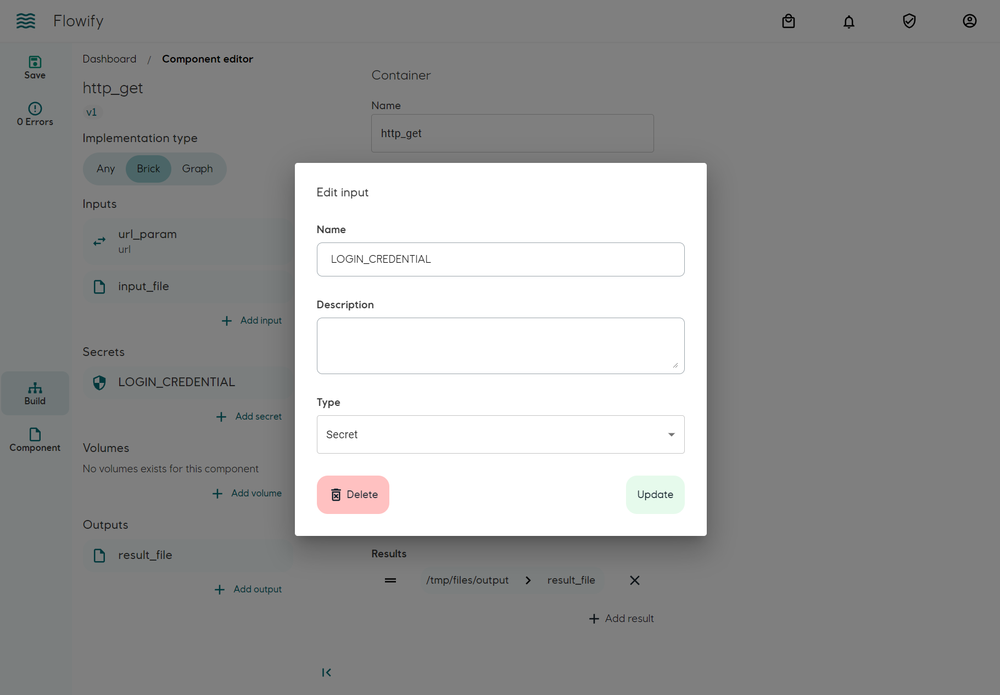
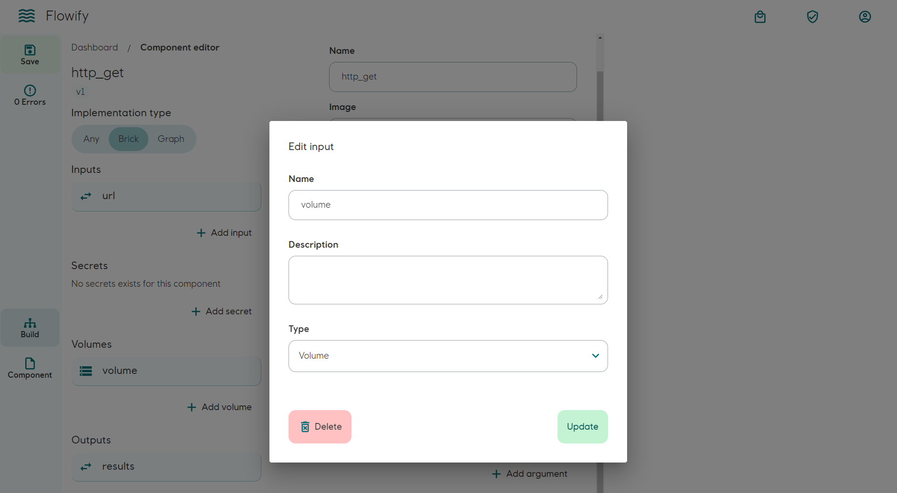
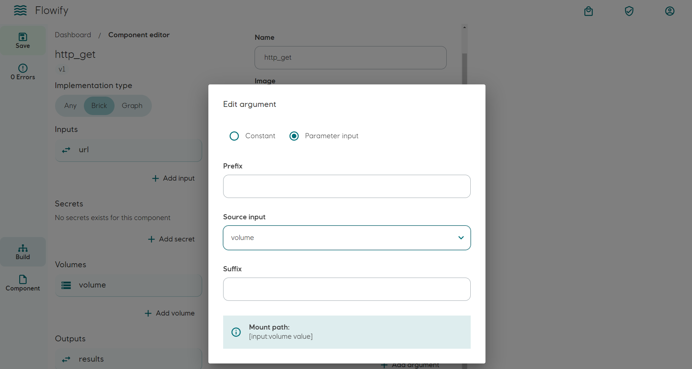

## Concept

The brick component is an representation of Argo Workflow's [`Container template`](https://argoproj.github.io/argo-workflows/fields/#container). The implementation at run time is handled by Argo Workflow. Flowify is responsible for generating the `Container template` when used in a workflow. 

The core of a brick component consists of a OCI compliant container image. It is then wrapped around by a layer of input/output parameters, secrets and volumes. They are applied to the container by Argo Workflow as follows:

- Input parameters: Appened to the `Entrypoint` of the container
- Output parameters: Copied and its values extracted from the container on completion
- Input/Output Artifacts: Handled by Argo Workflow and copied to and from the container
- Secrets: As environmental variables
- Volumne mount: Mount to the container using a corresponding CSI driver

One difference on the user level to Argo Workflow is Flowify handle Artifacts as Input/Output instead of a separate entity. It makes allows a more explicit and declarative data flow.

## Private container registry

Pulling of container images from private registry is handled either by [Argo Workflows](https://github.com/argoproj/argo-workflows/blob/master/examples/image-pull-secrets.yaml) or [Kubernetes](https://kubernetes.io/docs/tasks/configure-pod-container/configure-service-account/#add-imagepullsecrets-to-a-service-account). Flowify does not verify if the cluster has permission to pull the image.

## Building a brick

Prerequisities:

- Basic knowledge of container
- A published OCI compliant container image

### Basic setup
In this example we will build a brick component that perform a HTTP GET request and uses the response as output

Example image: [`ghcr.io/equinor/flowify-component-http:0.0.1`](https://github.com/equinor/flowify-component-http)

As Flowify uses Argo Workflows as executor, `ENTRYPOINT` must be defined explicitly in command:

`Args` are appended to the `ENTRYPOINT` command. They can be a constant (e.g. `http_method=get`) or variables from input parameters (e.g. `url=`). In this example, the full command will be 

`node ./src/index.js http_method=get url=<INPUT_URL_FROM_FLOWIFY_PARAMETER>`


#### Setting constant parameter. (Fixed for all execution)


#### Input parameter. (Variables injected by workflow)


#### Setting output parameter
Add an output on the left-hand pane and choose the correct `Type`. Use `Parameter_array` if you would like to utilize the [parallelized Map component](./map.md) feature, otherwise use `Parameter`. When using `Parameter_array`, Flowify will try to parse the output as array. The content of the output file is expected to be `[1, 2, 3]`. [More details](map.md).

`Mediatype` is only for annotation purpose.

The container saves the GET response under `/tmp/files/output.json`. We will need to define an output on the left-hand pane and mapped it to results on the right-hand pane. Flowify/Argo Workflows will extract values from the file and passes to the next component as input.



#### Overview


### Using files (Artifacts)
Instead of parameter values, it is possible to pass data across components using a file (Artifact). It is advised to limit the usage of Artifacts in order to keep data flow lineage explicit.

[An Artifact Repository](https://argoproj.github.io/argo-workflows/configure-artifact-repository/) must be configured in Argo Workflows. Flowify does not verify the configurations.
#### File as input
Add an component input on the left-hand pane and select artifacts as input type.


Pass the path location of the artifact inside the container as `Args`. In this example, the full path will be available as ``file=/artifacts/input_file` in the container run arguments.


The path of the input artifact is `/artifacts/<INPUT_PARAMETER_NAME>`. You will need to make sure the container has the permission to access the file. See [volume mount example](./bricks.md#add-volume-mount)

#### File as output
Select artifacts as output type on the left-hand pane. The file will be used as parameter in a workflow. Contents of the file will not be extracted.


### Add secrets
To add secrets to the component, add them on the left-hand pane. The secrets will be available as Environmental variables inside the container with the same name. 
Naming must not begin with digits and not contain spaces (use dash `_` ). It is conventional to use all uppercase characters.

In this example the name of the environmental variable is `LOGIN_CREDENTIAL`. The value will be injected by a workflow.


### Add volume mount
Add volume mount as brick input on the left-hand pane.



Afterwards, add an `Args` on the right-hand pane. If leaving out prefix and suffix, the mount path to the container will be `/<NAME_OF_VOLUME_INPUT>`. The volume mount argument will not be appended to the ``docker run` arguments
.


As the container is run as non-root in Flowify, make sure the container has read permission to the mount path. It can be achieved in Dockerfile for example:

```bash
RUN mkdir /<NAME_OF_VOLUME_INPUT>
RUN chmod -R 777 /<NAME_OF_VOLUME_INPUT>
```

It is advised to limit the usage of volume mount in order to keep data flow lineage explicit.

### Versioning and modifications
Under development