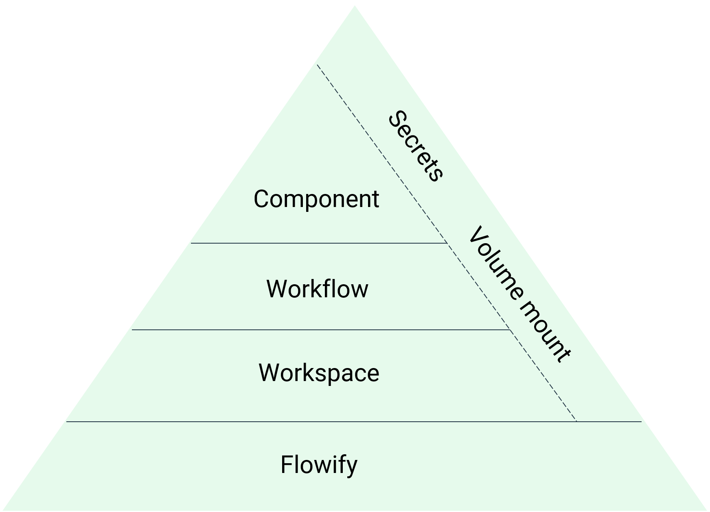

The basic building block of Flowify is a component. Components are built by users with some programming background. No-code users are then able to construct workflows from components using a drag and connect interface. Workspaces define the working environment for no-code users and provide security sandbox through features provided by Kubernetes and Argo Workflows.

Workflows, Secrets and volume mount are scoped to their respective workspace. Each workspace has their own Kubernetes namespace for execution of workflows, volume mount and secrets.

