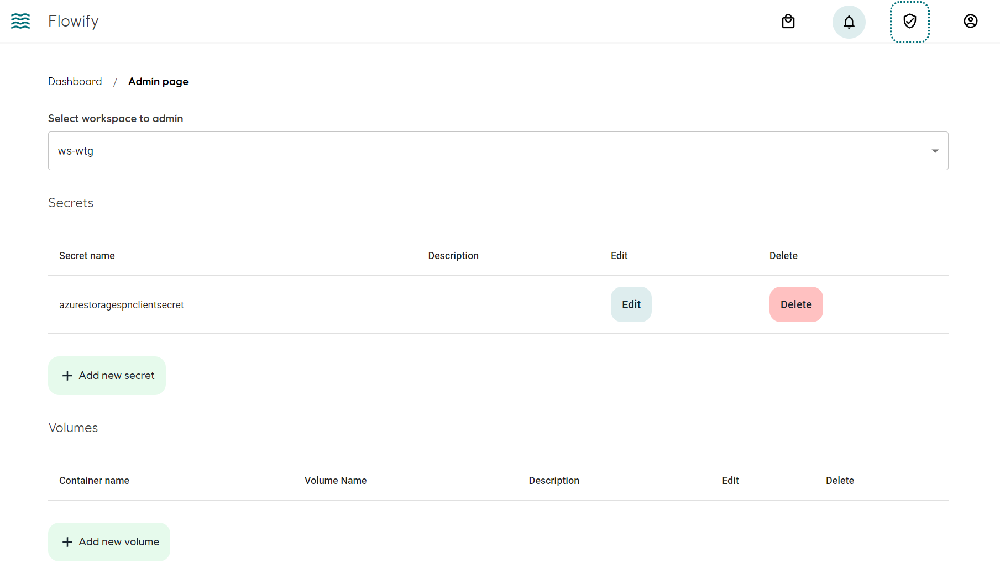
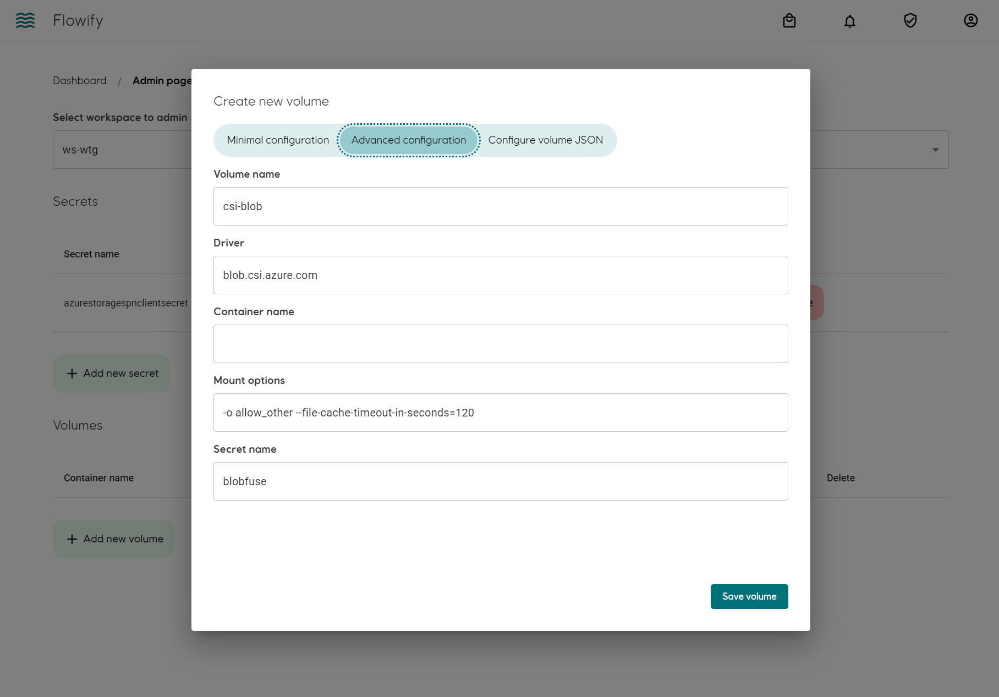

## Concept
Volume mount allows mounting a of cloud storage volume on the container without explicitly carrying out download/upload operations inside the container. It can be used to load large data set from Blob Storage and take advantage of built-in caching/buffering capabilities of a CSI driver. 

An example of CSI driver is [Azure Blob Storage CSI](https://github.com/kubernetes-sigs/blob-csi-driver). However, it is advised to limit the usage of volume mount in order to keep data flow lineage explicit to the end user.

Mounting of a volume is handled by Kubernetes. Flowify and Argo Workflows does not verify if the correct CSI driver is installed on the Kubernetes cluster. The Flowify volume mount configuration is transpiled into [`CSIVolumeSource`](https://argoproj.github.io/argo-workflows/fields/#csivolumesource) in Argo Workflows manifest.

## Access Control
Workspace admin can create, modify and delete Volume mount. The reference to the volume mount is available to all workspace user for use in workflows.

## Add volume mount to workspace
Go to workspace admin page. The volume name will be the name that is presented to the user to select on building workflows. The actually name of the volume as environmental variables is dictated by a [component](bricks.md#add-volume-mount).

### Setup
|      Parameter name      |  Description |
|:-------------:|:------:|
|  Volume name | Name presented to users for building workflow |
|    Drive   |   Kubernetes CSI driver |
| Container name |    Name of Azure Blob Container (For blob csi) |
| Mount options |    Options relavent to the CSI driver |
| Secret name |    Name of Kubernetes secret for authentication|

### Add credentials for the CSI driver
A kubernetes secret has to be manually set on the cluster in the same namespace as the workspace
See [https://github.com/kubernetes-sigs/blob-csi-driver/blob/master/deploy/example/e2e_usage.md#option2-use-secret](https://github.com/kubernetes-sigs/blob-csi-driver/blob/master/deploy/example/e2e_usage.md#option2-use-secret)

See [Components](./bricks.md#add-volume-mount) and [Workflow](./workflows.md#volume-mount) for usage