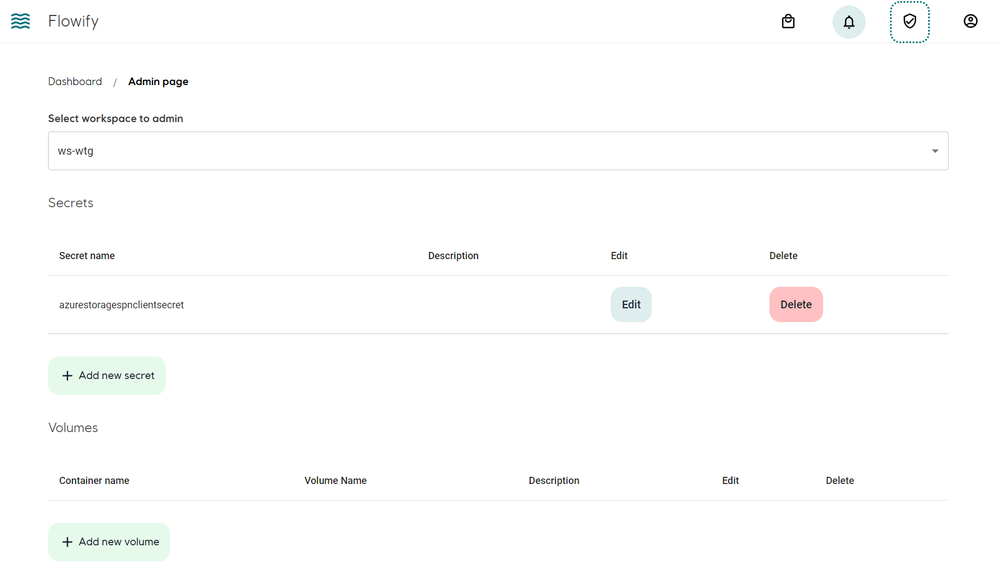

## Concept
Secrets allow passing sensitive information to the workflows such as login credentials to a resource.

Secrets are workspace scoped and stored as Kubernetes secrets in workspace's own Kubernetes namespace. The reference to the secrets is transpiled by Flowify into [Argo Workflow manifest](https://argoproj.github.io/argo-workflows/walk-through/secrets/). They are available as environment variables in the container.

## Access Control
Workspace admin can create, modify and delete secrets. The reference to the secrets is available to all workspace user for use in workflows.

Once a secret is added or modified, the secret value is not available to view on the frontend.

## Add secret to workspace
Go to workspace admin page. The secret name will be the name that is presented to the user to select on building workflows. The actually name of the secret as environmental variables is dictated by a [component](bricks.md#add-secrets).

See [Components](./bricks.md#add-secrets) and [Workflow](./workflows.md#setting-secrets) for usage