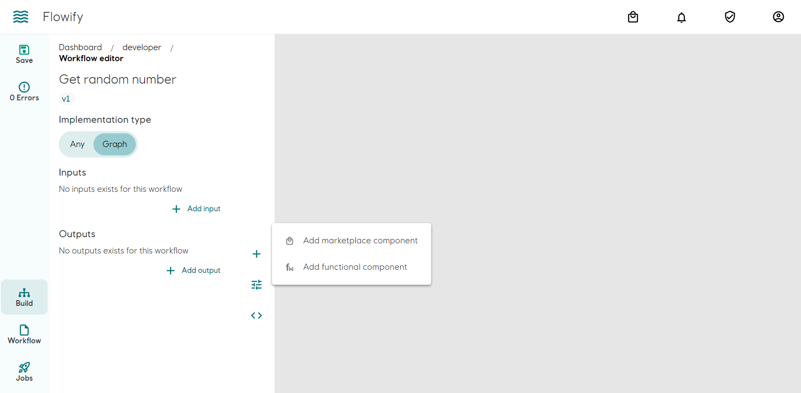
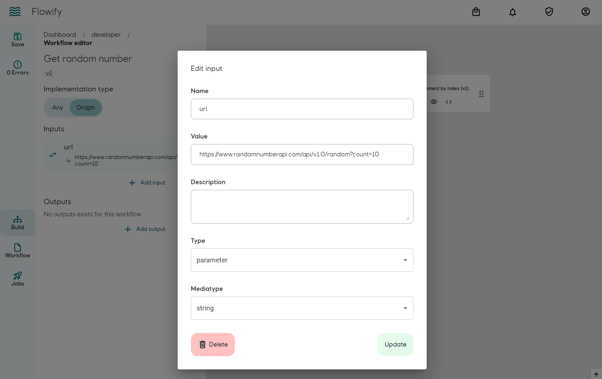
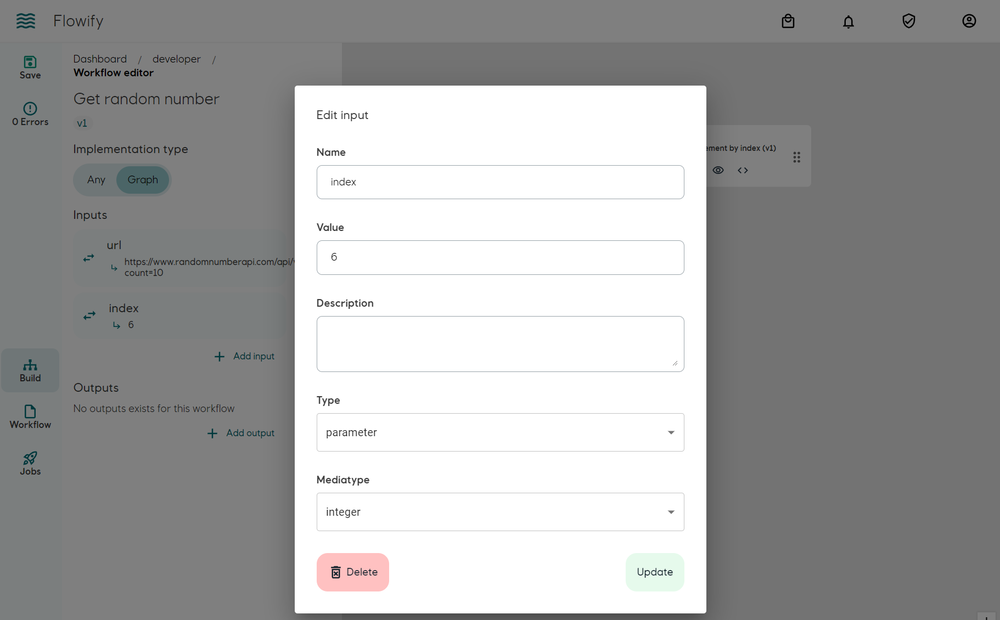
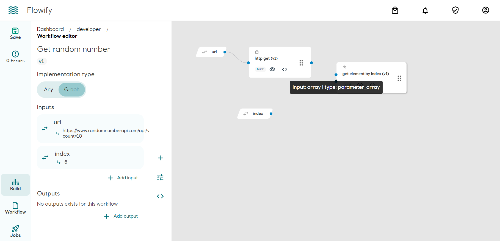
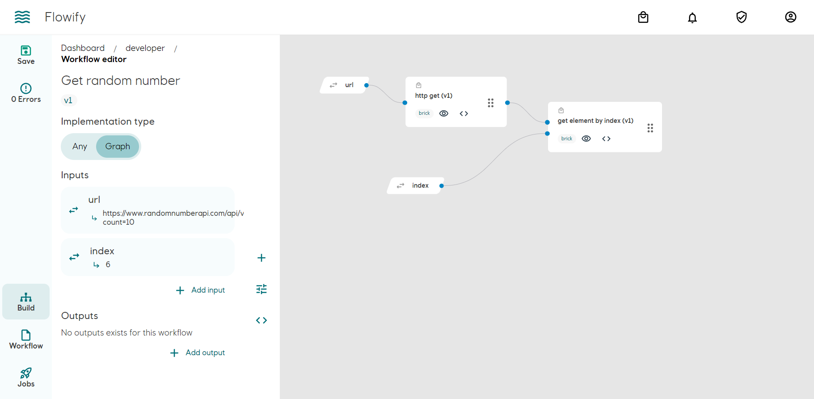
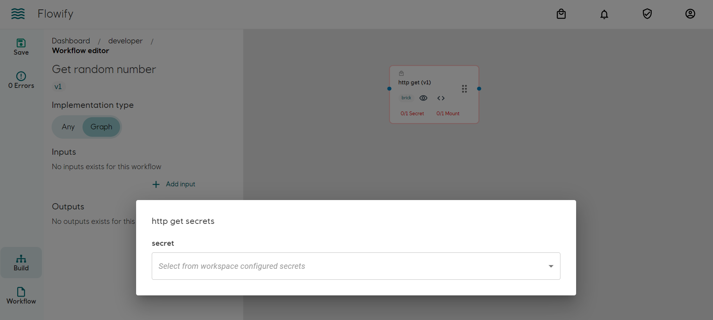
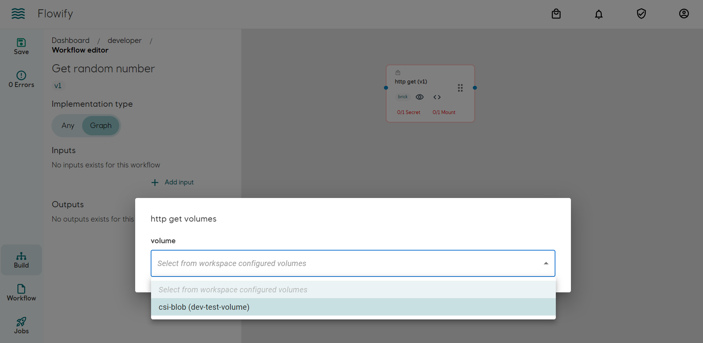

## Concept

Workflow is Flowify's representation of Argo Workflow's [DAG](https://argoproj.github.io/argo-workflows/walk-through/dag/). For the end user, it is a series of component with their outputs connected to others input. When a run is triggered, Flowify will transpile the manifest into Argo Workflow's manifest and submit the job. The progress and results are tracked in [Jobs](./jobs.md)

## Access Control
All workflows are restricted to the workspace that it was created under.

### Create
All workspace user can create workflows

### Modify
All workspace user can modify workflow and publish new version. It is not permitted to modify published version.

### Running the workflow
All workspace user can run workflows in a workspace with/without modifying parameters.

### Delete
Workspace admin can delete any workflow.

## Building a workflow

We will use the HTTP GET component from [building a brick](./bricks.md#building-a-brick) to fetch an array(list) of random number from [https://www.randomnumberapi.com/api/v1.0/random?count=10](https://www.randomnumberapi.com/api/v1.0/random?count=10). As the API returns an array of number, try to build a new brick component that extract the an item of an array and set the item as an output.

### Objective
We set an workflow input (a URL) and pass it into the HTTP GET component. The HTTP GET component will output an array of numbers. The array will then passed into another component extracting the first item and print to log.

### Adding components
Add required components from marketplace

### Adding workflow inputs
Add URL as workflow input parameter. Use https://www.randomnumberapi.com/api/v1.0/random?count=10 as value. The value can be modified before running the workflow.

Add the index (position) of the number that you need to extract from the array

### Linking the components
Connect the dots on the components by drag and connect. Hover your cursor on the dot shows type hint of the parameter. 

- Connect the workflow URL input parameter to the HTTP GET component URL input parameter.
- Connect the index paramter to the get element by index component.
- Connect the output node from HTTP GET component to the get element by index component.

Overview

### Setting Secrets
If a component requires secret, it will be shown on the component box. Click on the red text to add secret from the workspace. [Workspace secret](./secrets.md) has to be setup by admin.

### Volume mount
Volume mount can be added in a similar way as secret. [Workspace volume](./mounts.md) has to be setup by admin.

## Running a workflow
See [Jobs](./jobs.md)