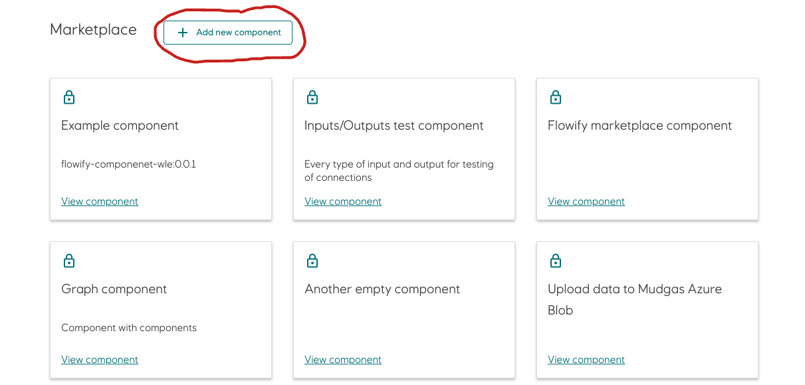
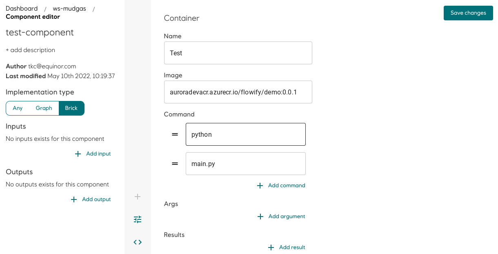
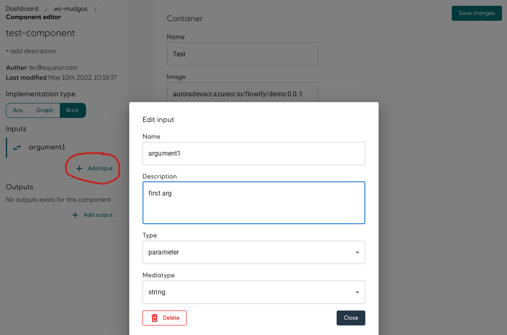
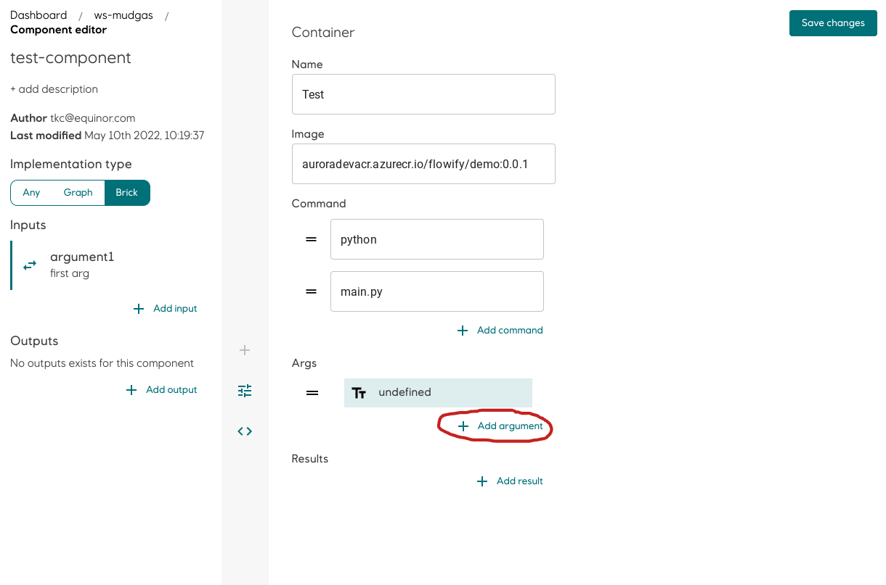
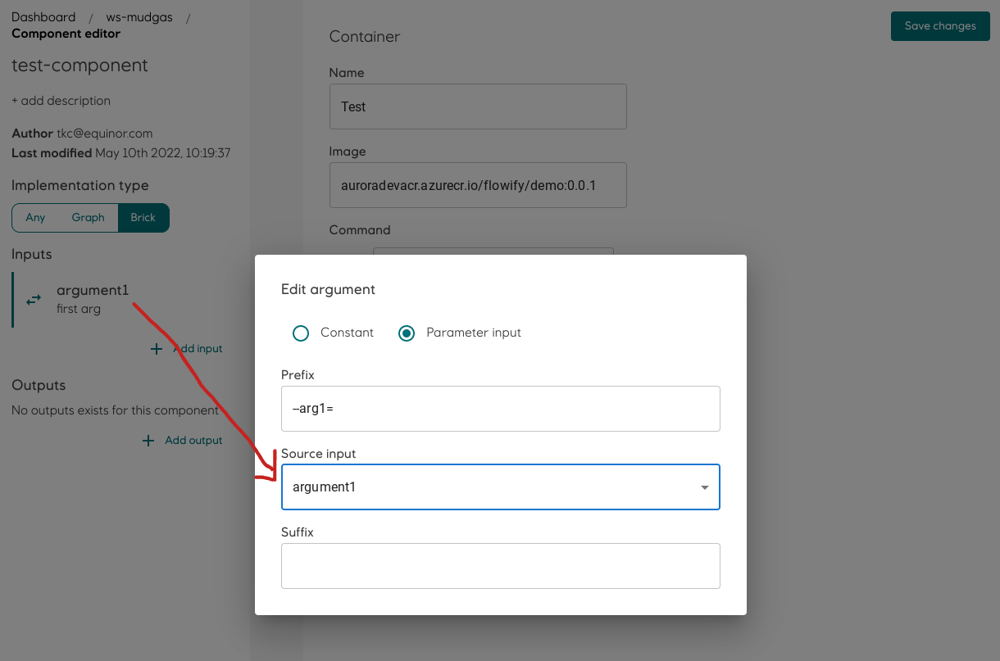
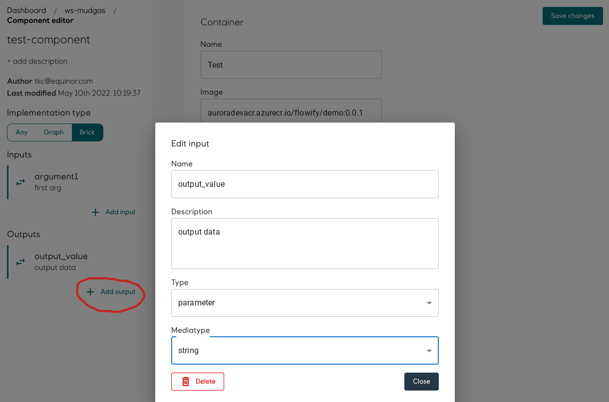
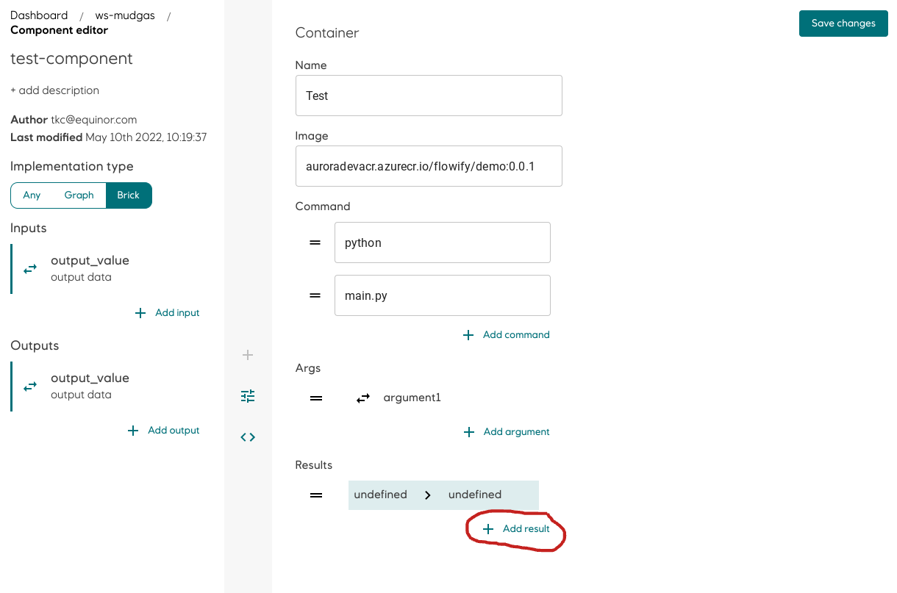
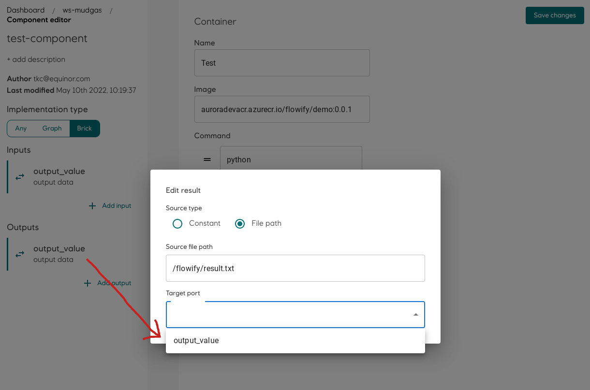
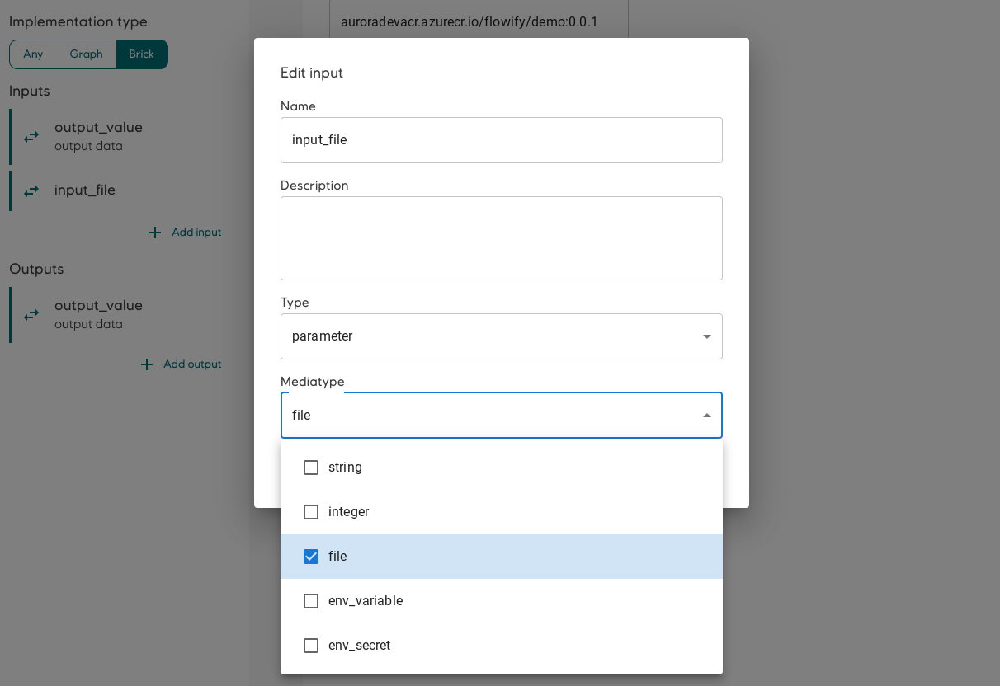
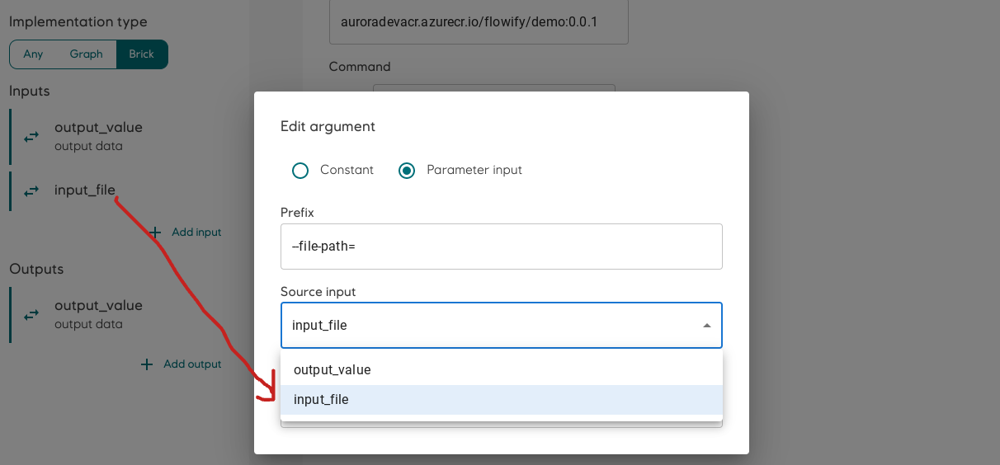

### Building a component using brick

#### Requirements:
- Basic knowledge of Docker
- Docker image published to Aurora Container Registry

#### Example:

Considering a python script that can be run in the terminal using 

```python main.py --arg1=hello --arg2=world```

When included in a Docker image and published to ```auroradevacr.azurecr.io/flowify/demo:0.0.1``` , the docker run command could be:

```docker run --entrypoint "python main.py" auroradevacr.azurecr.io/flowify/demo:0.0.1 --arg1=hello --arg2=world```


The docker also has an output value stored in a file at /flowify/result.txt

Sensitive information such as credentials should be passed as Environmental variables. they can be accessed inside docker by:

Python: ```os.environ[<NAME>]```

Javascript: ```process.env.<NAME>```

In this example, we will have a credential named ```SECRET```

#### Putting it in Flowify:
Click Add component

The component editor has two part. The left is used to define the inputs and outputs interfaces used by Flowify and the righthand pane set up the docker images and its relation to Flowify inputs and outputs.

Fill in the image tag and entrypoint command (Flowify does not use default ENTRYPOINT or CMD of the image)


Add an input on the left hand pane. Select ```parameter``` if it is to be defined by the workflow runner or ```Secret``` which allows user to select a workspace secret to pass into the docker container as Environmental variable. The name of the Environmental variable inside the docker container will be the same as the Flowify input name defined here
Choose the expected data type (Mediatype) to guide users if the input type is parameter


Map it to the arguments that will be passed to the docker container by adding an argument.


To pass ```--arg1=hello``` to the docker command, Set prefix to ```--arg1=``` and source input as the Flowify input. Flowify passes Flowify input to docker run command by string concatenation: ```<Predix><Source input><Suffix>```


Create an Flowify output and choose the correct data type (mediatype)


Add a result on the righthand pane


Select the file inside the docker container where the value is stored and map the Flowify output to the result's Target port. Flowify will extract the value and make it available for other components in a workflow.

If you prefer to pass the file instead of passing a value, choose file as data type (mediatype) in the Flowify Input. 

It is preferred to pass output as value because it improves inter-operability betwwen components.


#### Using files as input:
All input files are copied to ```/artifacts/``` . Since all docker containers are run as non-root in Flowify, it is important to make sure the docker image has read permission to the folder. It can be achieved in Dockerfile for example:
```
RUN mkdir /artifacts
RUN chmod -R 777 /artifacts
```
The full file path will be available to the component as parameter value. For example, it can be passed to the run arguments of a Python script by:

```python main.py --file_path=<PATH>```

In Flowify component builder, specifiy an input parameter with data type (mediatype) ```file```.


Create a new argument with prefix ```--file_path=``` and map the Flowify Input to the source input of the argument


You can then access the file path in e.g. Python by:
```
import argparse
parser = argparse.ArgumentParser(description='Example')
parser.add_argument('--file_path','-f', action='store',
                    help='input file path')
args = parser.parse_args()
args.file_path                    
```


----------------------------


<!---

{}
This is a placeholder page that shows you how to use this template site.
{}


The Overview is where your users find out about your project. Depending on the size of your docset, you can have a separate overview page (like this one) or put your overview contents in the Documentation landing page (like in the Docsy User Guide).

Try answering these questions for your user in this page:

## What is it?

Introduce your project, including what it does or lets you do, why you would use it, and its primary goal (and how it achieves it). This should be similar to your README description, though you can go into a little more detail here if you want.

## Why do I want it?

Help your user know if your project will help them. Useful information can include:

* **What is it good for?**: What types of problems does your project solve? What are the benefits of using it?

* **What is it not good for?**: For example, point out situations that might intuitively seem suited for your project, but aren't for some reason. Also mention known limitations, scaling issues, or anything else that might let your users know if the project is not for them.

* **What is it *not yet* good for?**: Highlight any useful features that are coming soon.

## Where should I go next?

Give your users next steps from the Overview. For example:

* [Getting Started](/docs/getting-started/): Get started with $project
* [Examples](/docs/examples/): Check out some example code!

-->