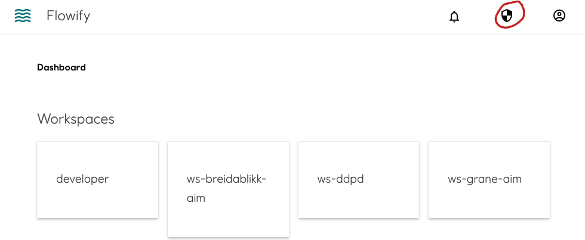
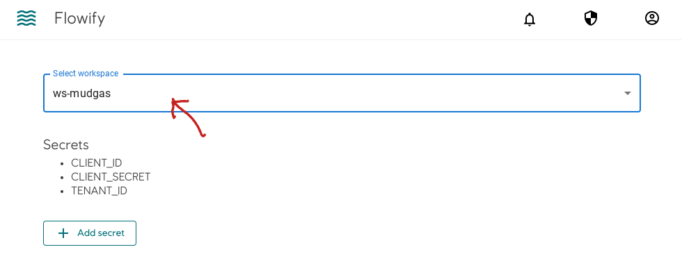
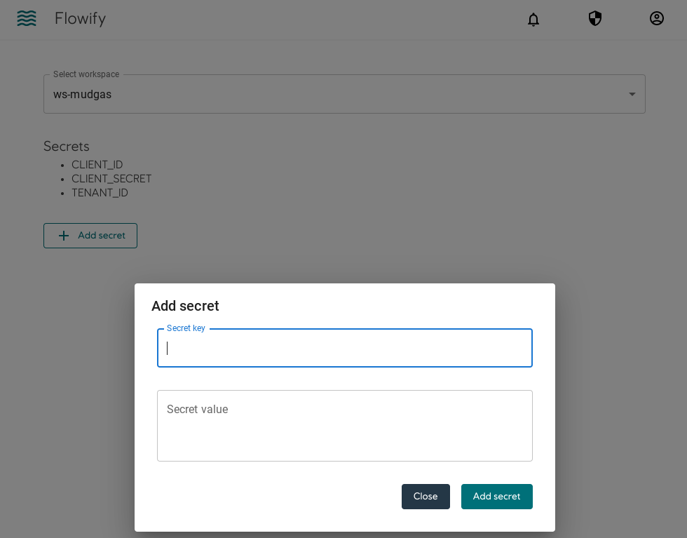

### What is secrets

Secret is anything that is required to run the component but you don't want to show the value to the user. An example is login credentials to an API server.

------------------------

### Secrets in workspace

All users in a workspace can add or modify secrets that belong to the same workspace. No one can see the value of the secret after it has been added. Only the name is visible. In practice they are mounted as Kubernetes secrets to the same namespace as the workspace.

------------------------

### Secrets in workflows and components

The values of secrets are passed as Environmental Variables to components. 
See build component and/or build workflow documentation for details.

------------------------

### Add/modify secrets

Click the shield icon on the upper right.

Choose the relevant workspace

Add secret. To modify an existing secret, type in the same name in secret key.
