### Basic idea
A workflow is a series of steps that is ready to be run. The steps are defined as components in Flowify. Each component has input(s) and output(s). A workflow can be made by linking component output(s) to component input(s). Inputs for workflow can also be defined and link to the input of components. When you run a workflow, it creates a Job.

All users in a workspace can create, edit and run workflows.

-------------------------
### Creating a workflow

**Add new workflow in a workspace**
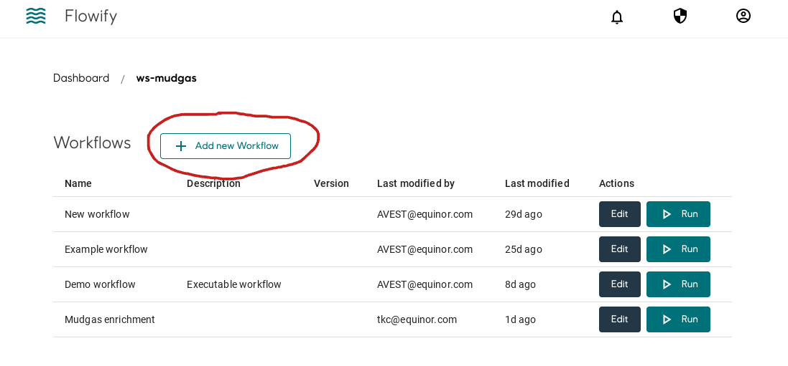

**Click the plus icon to add components to the workflow**
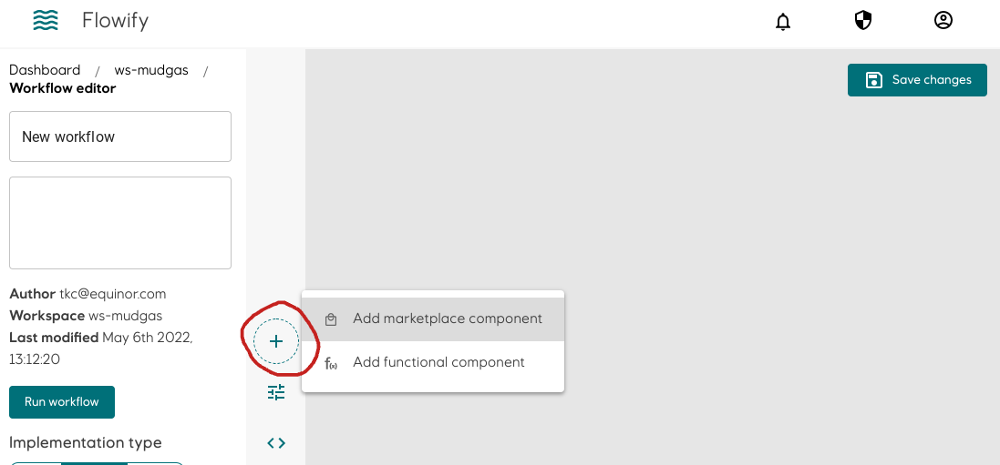

**Add the required components**
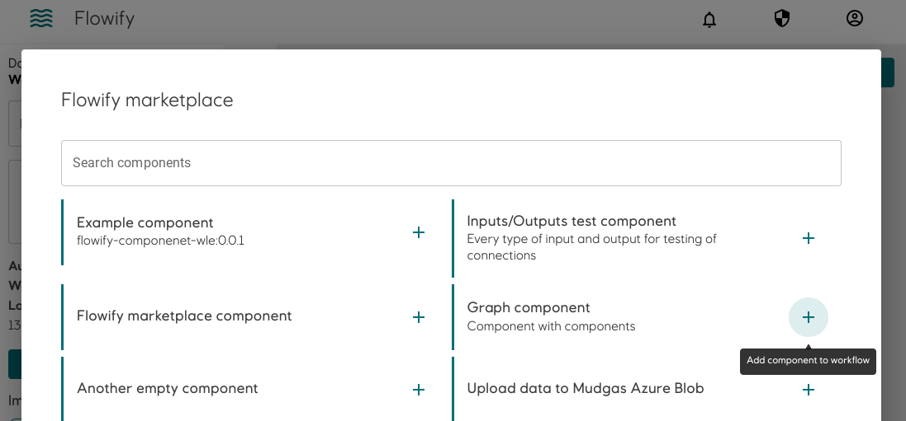

**Connect output to input by doing drag-and-drop on the node (blue dot). Hover your mouse on the node to get more information of the input/output. You can only connect node with the same media type**
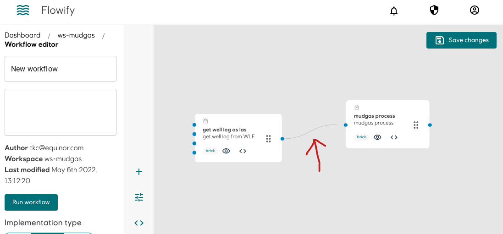

**Create a new input parameter for the workflow**
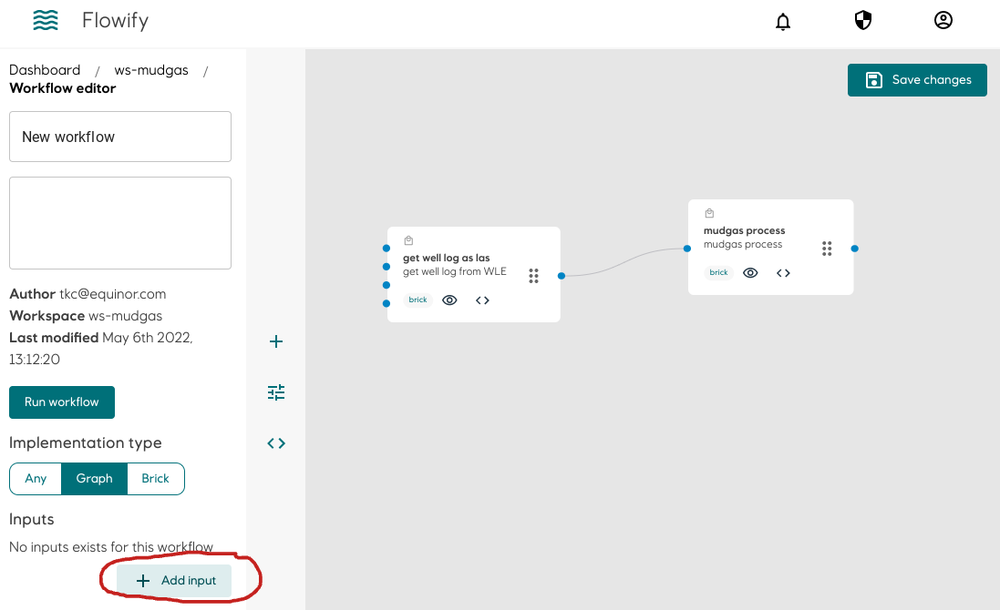

**Fill in the name and the value of the input parameter. The value can be changed before running the workflow. Choose the correct media type (data type): string (text) or number**
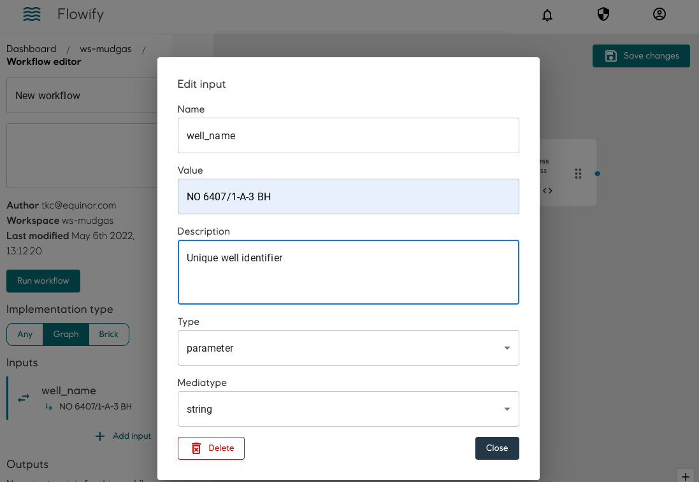

**To pass a secret into the workflow, select secret under input type**
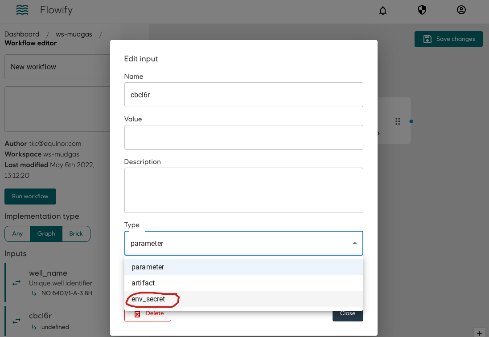

**All the workspace secret will be available to choose**
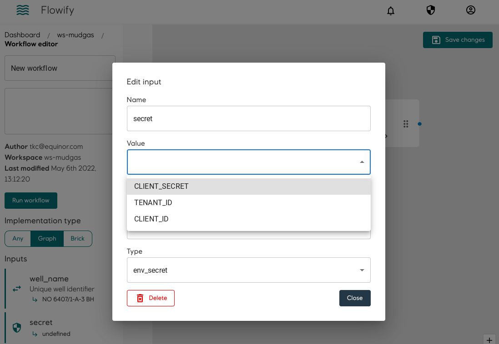

**Connect workflow input or secrets into component(s) in the same way as connecting components**
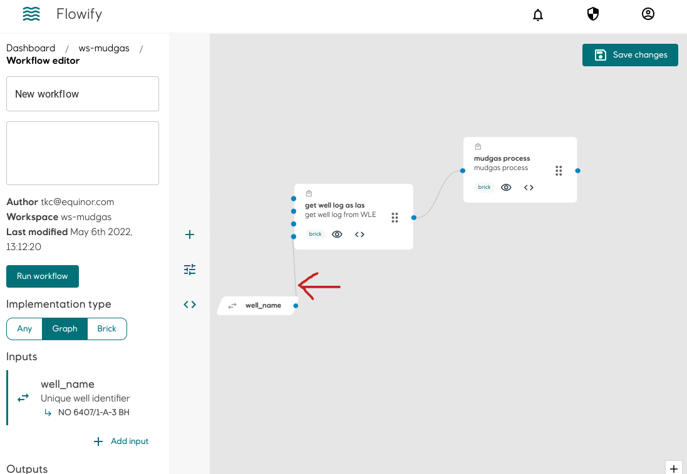

**To delete a connection, zoom in, click on the line (It will become bold) and then press backspace**
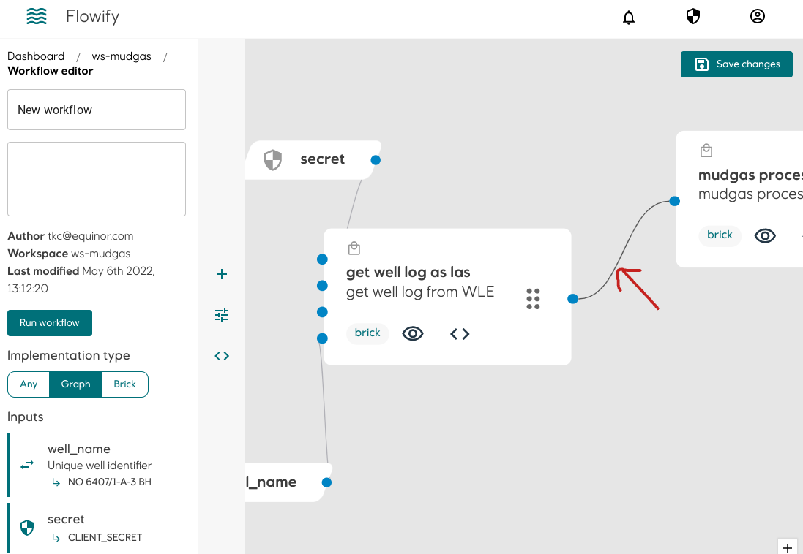

**After clicking run workflow on the left, you will be able to edit the input parameters and/or add description to the job that will be created.**
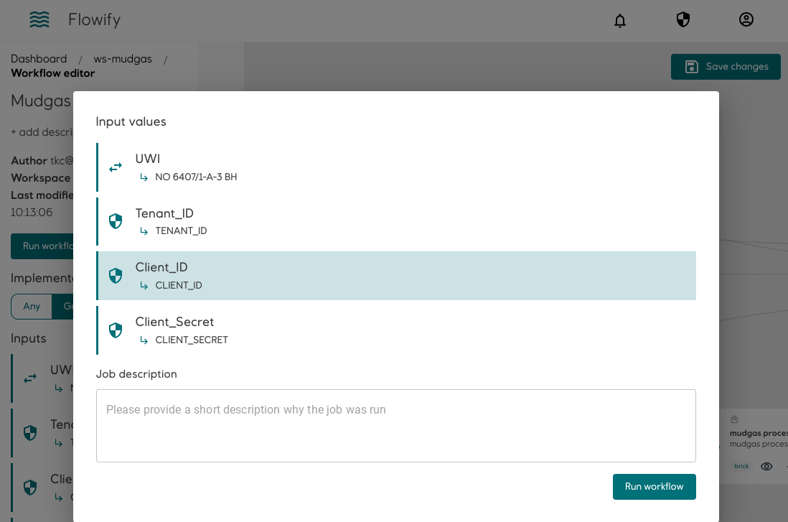