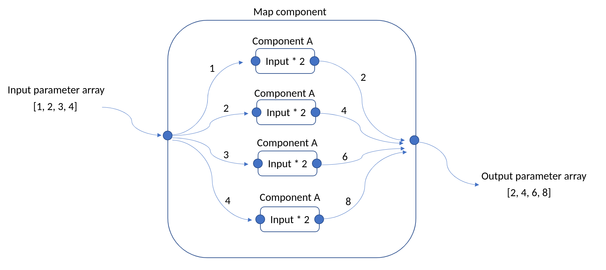
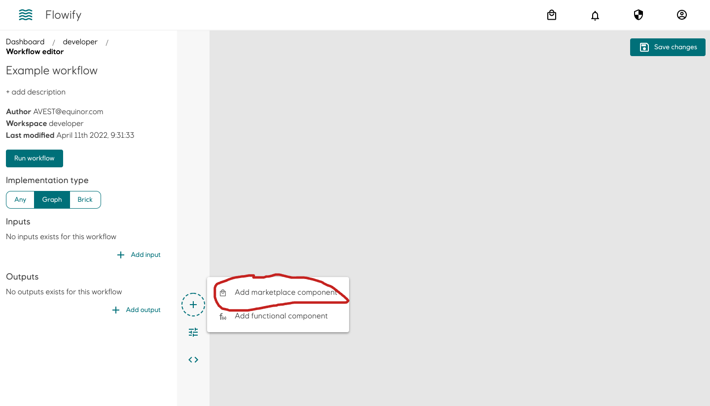
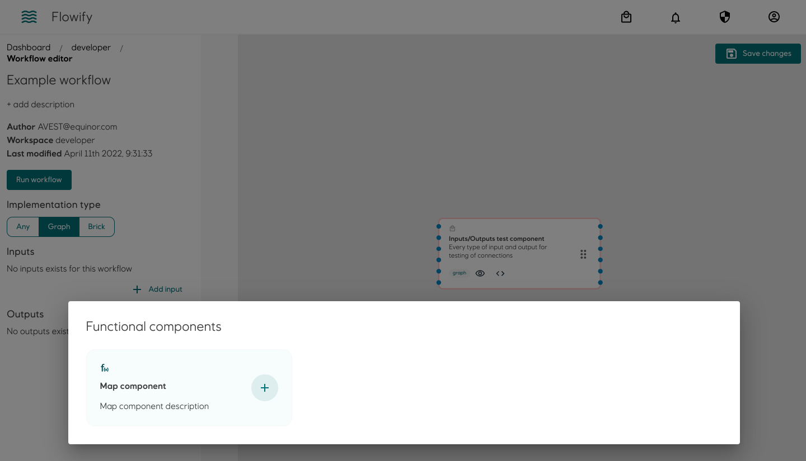
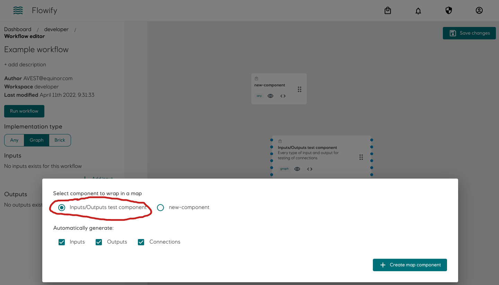
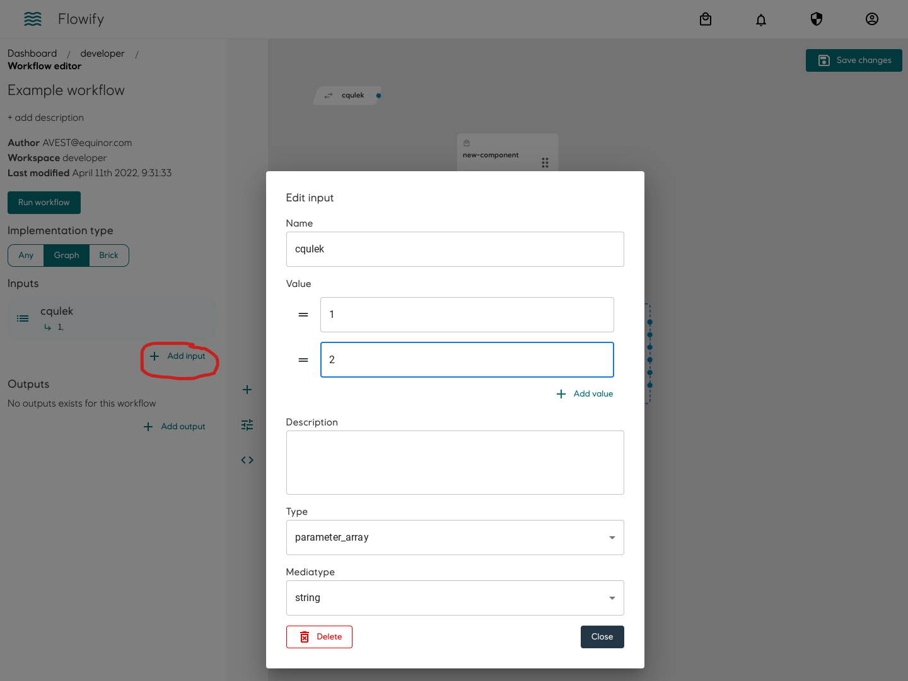
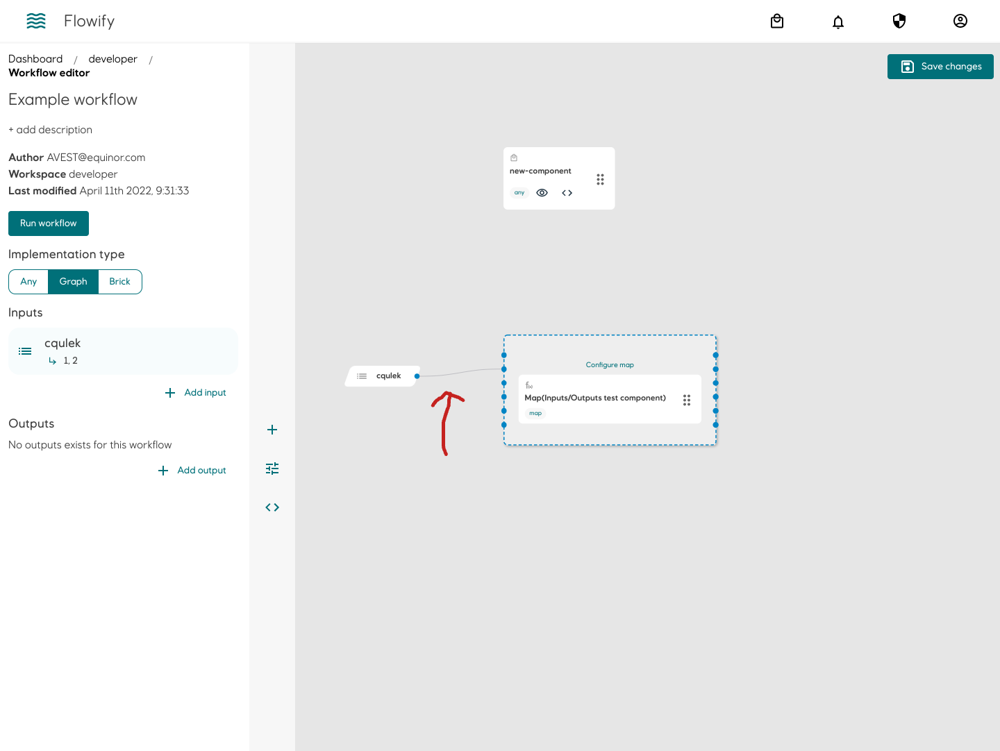

### Parallel tasks in a workflow
It is possible to run parallel task on a list of input of the same type. It will speed up workflow when there is no interdependency between the parallelized tasks. In Flowify it is accomplisted by wrapping a component in a Map component. One of the inputs to the Map component has to be an parameter array (list), Flowify will spawn a new task for every item in the parameter array. Results from each parallel tasks will be concatenated into an parameter array as an output of the Mp component.

#### Concept:

#### Setting up in Flowify:
Add a component that you would like to parallelize

Add a Map component under Functional component

Select the component that you would like to wrap in a Map component

Create a parameter array (list) in the workflow inputs

Connect the parameter array input to the Map component

----------------------------

<!---

{}
This is a placeholder page that shows you how to use this template site.
{}

The Overview is where your users find out about your project. Depending on the size of your docset, you can have a separate overview page (like this one) or put your overview contents in the Documentation landing page (like in the Docsy User Guide).

Try answering these questions for your user in this page:

## What is it?

Introduce your project, including what it does or lets you do, why you would use it, and its primary goal (and how it achieves it). This should be similar to your README description, though you can go into a little more detail here if you want.

## Why do I want it?

Help your user know if your project will help them. Useful information can include:

* **What is it good for?**: What types of problems does your project solve? What are the benefits of using it?

* **What is it not good for?**: For example, point out situations that might intuitively seem suited for your project, but aren't for some reason. Also mention known limitations, scaling issues, or anything else that might let your users know if the project is not for them.

* **What is it *not yet* good for?**: Highlight any useful features that are coming soon.

## Where should I go next?

Give your users next steps from the Overview. For example:

* [Getting Started](/docs/getting-started/): Get started with $project
* [Examples](/docs/examples/): Check out some example code!

-->