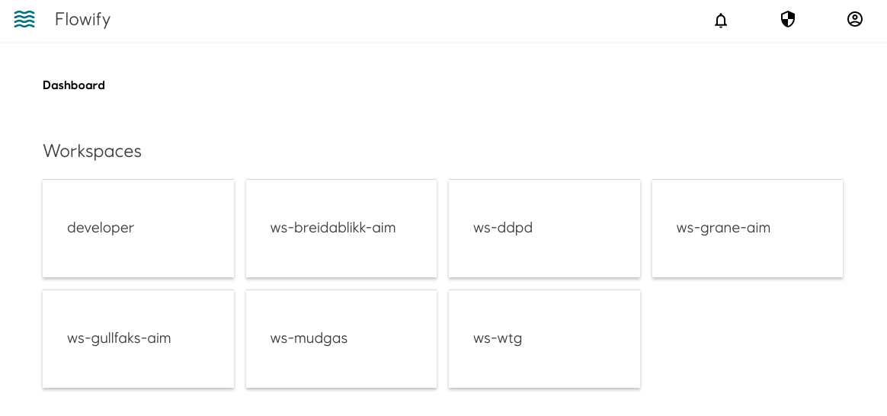

### Create workspace
Currently, it is a manual process to create new workspace. Please contact our team. Flowify uses Role based access control and requires an Azure AD Group. All members of the AAD group will have access to the workspace. Owners of the group will also need to be added as Members as well.

----------------------------
### In Practice
All users that have access to the workspace will be able to:
- Create, edit and run workflows
- Create and edit workspace components
- View jobs
- Add and update secrets

More granular access control is planned. Please get in touch if you have any suggestions.

----------------------------

### Landing page of Flowify listing workspaces
